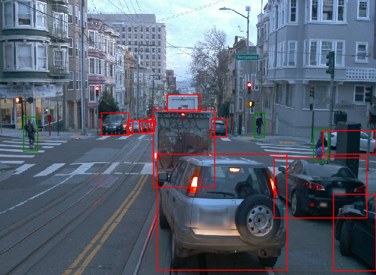
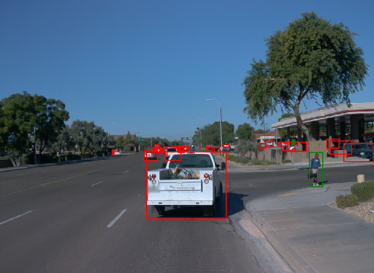
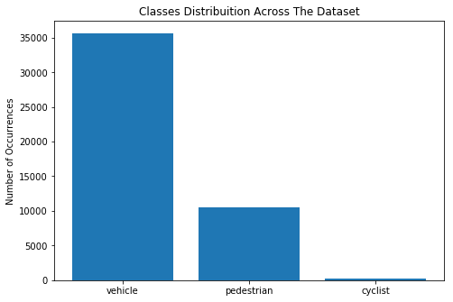
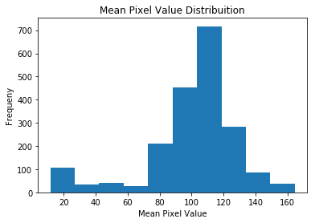
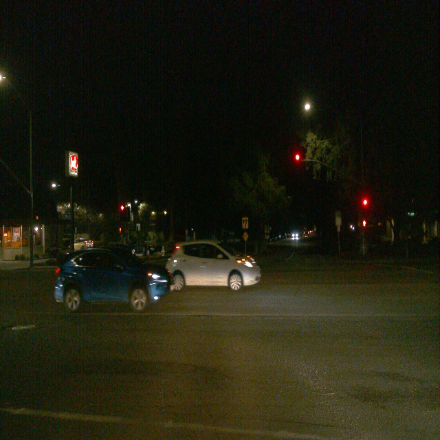
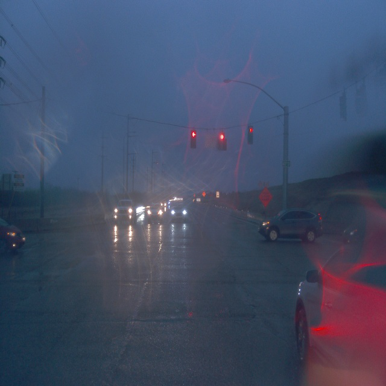
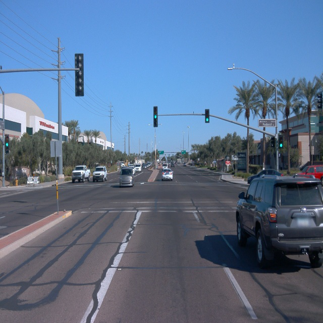

# Object Detection in an Urban Environment

### Project overview
**_Note: This is a submission for the Object Detection in an Urban Environment project, which is part of the [Udacity Self Driving Car Engineer Nano Degree](https://www.udacity.com/course/self-driving-car-engineer-nanodegree--nd0013)._**

Object detection in urban environments is critical for self-driving cars, because it allows the car to understand its surrounding and plan accordingly. For example, the car may slow down after detecting a pedestrian at a crossing or apply emergency breaks if it detects that it is on a collision course with another vehicle.

This project uses Tensorflow to train a machine learning model on samples from the [Waymo Open Dataset](https://waymo.com/open/). The projects covers:

* Analysing the dataset.
* Determining the data split for training, validation and testing.
* Modifying the provided model to improve the results.

---

### Set up
#### Project Structure
```
build/
    - Dockerfile
    - README.md
    - requirements.txt
experiments/
    - exporter_main_v2.py - to create an inference model
    - label_map.pbtxt - provides numerical ids for the classes in the dataset
    - model_main_tf2.py - to launch training
    - training/
        - pretrained-models/
        - reference/ - reference training with the unchanged config file
        - experiment0/  - a new folder should be created for each new experiment
        - experiment1/
        - experiment2/
        - ...
    ...
create_splits.py - used to create the data splits for training, validation and testing
download_process.py - used to download the dataset
edit_config.py - used to modify the pretrained model configuration file
inference_video.py - used to create a video of the model in action
utils.py - various convenience functions
Exploratory Data Analysis.ipynb - an analysis of the dataset
Explore augmentations.ipynb - used to visualise the augmentations in a given configuration file
filenames.txt - a list of all the dataset files' names
dark_files.txt - a list of the files containing dark scenes
rainy_files.txt - a list of the files containing rainy scenes
...
```

#### Environment Setup
Follow the instructions in `build/README.md` to set up the docker container with the required packages. **The following instructions should be executed from within the container.**

#### Downloading and processing the data
Run the following command to download and process the data:
```
python download_process.py --data_dir {processed_file_location} --size {number of files you want to download}
```

#### Creating the splits
To create the splits, run the following command:
```
python create_splits.py --data-dir data/
```
Note that the splits are based on the files in `dark_files.txt` and `rainy_files.txt`. The rationale behind the splits is covered later in this document.

#### Downloading and configuring a pretrained model
The project assumes that a pretrained model will be used as the starting point. To use the SSD Resnet 50 640x640 model:

1. Download the model from this [link](http://download.tensorflow.org/models/object_detection/tf2/20200711/ssd_resnet50_v1_fpn_640x640_coco17_tpu-8.tar.gz).
2. Extract the model under `pretrained-models/`, such that it matches the following hierarchy:
```
...
experiments/
    ...
    - training/
        ...
        - pretrained-models/
            - ssd_resnet50_v1_fpn_640x640_coco17_tpu-8/
        ...
    ...
...
```
3. Run the following command to create a configuration file with the split data locations and a modified batch size:
```
python edit_config.py --train_dir data/train/ --eval_dir data/val/ --batch_size 4 --checkpoint experiments/pretrained-models/ssd_resnet50_v1_fpn_640x640_coco17_tpu-8/checkpoint/ckpt-0 --label_map experiments/label_map.pbtxt
```
A new configuration file will be created.

_Note: for a list of other pretrained models, check this [link](https://github.com/tensorflow/models/blob/master/research/object_detection/g3doc/tf2_detection_zoo.md)._

#### Training & Validation
This section assumes the following file hierarchy:
```
...
experiments/
    ...
    - training/
        ...
        - experimentx/
            - pipeline.config
        ...
    ...
...
```
To train the model, run the following command:
```
python experiments/model_main_tf2.py --model_dir=experiments/experimentx/ --pipeline_config_path=experiments/experimentx/pipeline.config
```

To evaluate model, run the following command **in parallel with the training**:
```
python experiments/model_main_tf2.py --model_dir=experiments/experimentx/ --pipeline_config_path=experiments/experimentx/pipeline.config --checkpoint_dir=experiments/experimentx/
```

**_Note: if you do not have sufficient GPU resources, you may  not be able to run the training and validation scripts at the same time, one way to remedy this is to run the validation script on the CPU by using the following command instead:_**
<pre>
<b>CUDA_VISIBLE_DEVICES="-1"</b> python experiments/model_main_tf2.py --model_dir=experiments/experimentx/ --pipeline_config_path=experiments/experimentx/pipeline.config --checkpoint_dir=experiments/experimentx/
</pre>

Use tensorboard to visualise the training/validation progress:
```
tensorboard --logdir=experiments/training
```

---

### Dataset
#### Overview
The dataset contains 1997 images, split across 100 files. Each file contains ~20 images, which are taken from the same journey. These journeys were made in various day and weather conditions as shown in the images below:
<p float="left" align="middle">
  
   
  
</p>


#### Class Distribution Analysis
The images are annotated with 3 classes: pedestrian, vehicle and cyclist. However, these classes are not equally represented in the dataset:
<p float="left" align="middle">
  
</p>

As shown in the graph:
1. Vehicles severely outnumber pedestrians and cyclists.
2. There is a very low number of cyclists, relative to the other classes.
   
This inequality is likely to negatively impact the training and lead to poor generalisation.


#### Mean Pixel Value Analysis
The following figure shows that the mean pixel value of the images is normally distributed, rather than being uniformly distributed. This may be an indicator that the majority of the photos have average lighting and only a few photos are on the brighter and the darker ends of the spectrum. As a result, the model may generalise poorly in different lighting conditions.

<p float="left" align="middle">
  
</p>


#### Qualitative Analysis
One image from each of the 100 files was visualised to get a sense of the variability in the environment. Samples of these conditions are shown below. The complete set of images can be viewed at `images/samples`. There are some noteworthy observations from this visualisation:
1. Only 8 files contained dark scenes.
2. Only 11 files contained rainy scenes.
3. The rest of the 81 files contained scenes with mostly clear skies and daylight.

<p float="left" align="middle"> 
  <figure>
    
    <figcaption>Dark Scene</figcaption>
  </figure>

  <figure>
    
    <figcaption>Rainy Scene</figcaption>
  </figure>
  
  <figure>
     
    <figcaption>Daylight Scene</figcaption>
  </figure>
</p>

---

#### Cross validation
Given the relatively small number of images provided in this dataset, 75%, 15% and 10% of the images were allocated to the training, validation and testing was chosen. A larger share for the training set would have been more ideal; however, that would make the validation results less reliable.

The split was made based on the files, as opposed to combining all the images and randomly allocating them to different sets. This ensured that images from a given journey were only allocated to one set, rather than split between multiple sets. This was done to minimise the chance of overfitting and to ensure that the model generalises well for different journeys/conditions.

Another factor that was taken into account is the fact that there is a very small number of files that contained rainy and/or dark scenes. To minimise the impact of this uneven distribution, files containing rainy and dark scenes were distributed equally amongst the three sets. This was done to minimise overfitting and ensure that the validation and testing results are representative of the whole dataset. 

Based on all of the above, the following strategy was implemented:
1. Files were split into three lists: files containing dark scenes, files containing rainy scenes and all other files
2. Each of the three lists was shuffled
3. 75%, 15% and 10% of each list was allocated to the training, validation and testing sets, respectively 


### Training
#### Reference experiment
This section should detail the results of the reference experiment. It should includes training metrics and a detailed explanation of the algorithm's performances.

#### Improve on the reference
This section should highlight the different strategies you adopted to improve your model. It should contain relevant figures and details of your findings.
